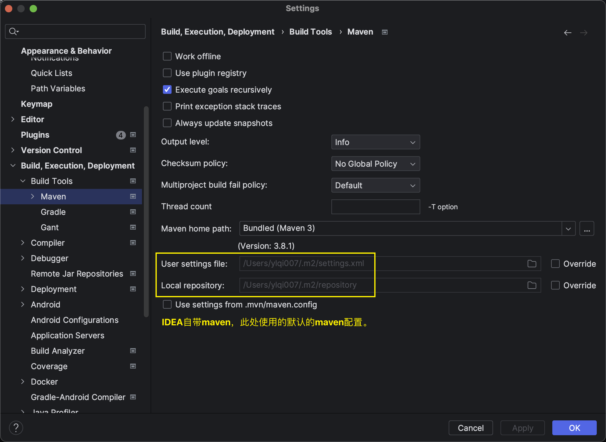
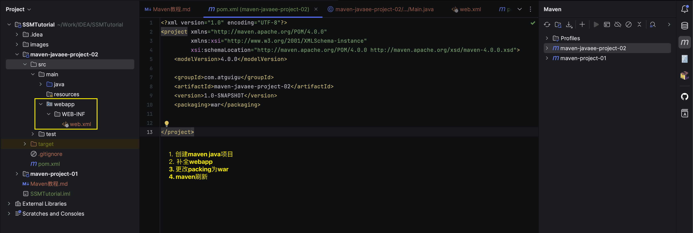

# 高效构建Java应用: Maven入门和进阶

## 1. Maven简介和快速入门
### 1.1 Maven介绍
Mavan是一款为Java项目构建管理、依赖管理的工具，使用Maven可以自动化构建、测试、打包和发布项目，大大提高了开发效率和质量。

### 1.2 Maven主要作用理解
核心功能:
1. 依赖管理: Maven 可以管理项目的依赖，包括自动下载所需依赖库、自动下载依赖需要的依赖并且保证版本没有冲突、依赖版本管理等。通过 Maven，我们可以方便地维护项目所依赖的外部库，而我们仅仅需要编写配置即可。
2. 构建管理: 项目构建是指将源代码、配置文件、资源文件等转化为能够运行或部署的应用程序或库的过程！


## Maven安装

```shell
➜  ~ brew install maven

➜  ~ mvn -v
Apache Maven 3.9.9 (8e8579a9e76f7d015ee5ec7bfcdc97d260186937)
Maven home: /usr/local/Cellar/maven/3.9.9/libexec
Java version: 22.0.2, vendor: Homebrew, runtime: /usr/local/Cellar/openjdk/22.0.2/libexec/openjdk.jdk/Contents/Home
Default locale: en_US, platform encoding: UTF-8
OS name: "mac os x", version: "13.4", arch: "x86_64", family: "mac"
```

The `settings.xml` file can be found under directory `/usr/local/Cellar/maven/3.9.9/libexec/conf`

## 配置IDEA使用本地配置的maven，而不是IDEA自带的maven


## 2. 基于IDEA的Maven工程创建
Maven中的GAVP是指GroupId, ArtifactId, Version, Packing等四个属性的缩写，其中前三个是必要的，而Packing是可选的。
* GroupId: com.tabo.tddl
* ArtifactId: 
* Version: 
* Packing:
  * 属性默认为jar
  * war: 代表Java的web工程，打包以后为.war结尾文件。
  * pom: 代表不会打包，用来做继承的父工程。

### 2.2 IDEA构建Maven工程

### 2.3 IDEA构建Maven JavaEE工程



## 3. Maven的核心功能
### 3.1 依赖管理和配置

### 3.2 依赖传递和冲突

### 3.3 依赖导入失败场景和解决方案

### 3.4 扩展构建管理和插件配置(了解)
清理 --> 编译 --> 测试 --> 报告 --> 打包 --> 部署


## 4. Mavan继承和聚合特性


## Reference
* [Apache Maven Project](https://maven.apache.org/what-is-maven.html)
* [Where is Maven's settings.xml located on Mac OS?](https://stackoverflow.com/questions/3792842/where-is-mavens-settings-xml-located-on-mac-os)
* 课件: https://www.wolai.com/v5Kuct5ZtPeVBk4NBUGBWF
* 课件Maven: https://www.wolai.com/fbnhGx8eE9JfZugFpbCWmC